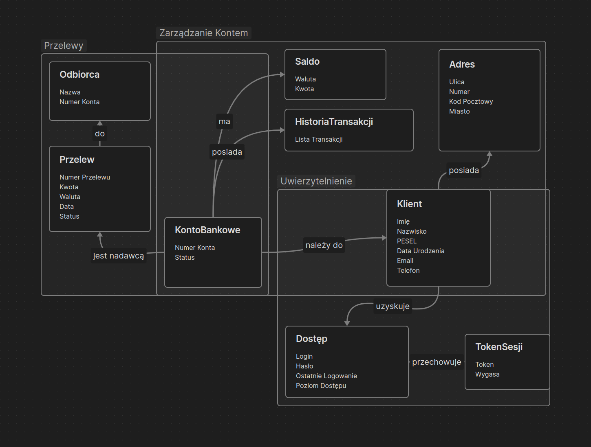

# Zadanie 1 - Domain Driven Design

## Opis Zadania

Celem zadania jest zamodelowanie fragmentu systemu bankowego, zgodnie z zasadami Domain Driven Design (DDD). Fragment koncentruje się na zarządzaniu kontem oraz realizacji przelewów. Zakres obejmuje kilka encji, agregaty i obiekty wartości, a także ograniczenia dotyczące ich atrybutów i formatów danych.

## Model Kontekstowy

System został podzielony na trzy główne Bounded Contexty:
1. Zarządzanie Kontem – odpowiedzialny za przechowywanie danych o kontach bankowych i klientach.
2. Przelewy – realizuje procesy związane z przelewami pomiędzy kontami.
3. Uwierzytelnienie – obsługuje logowanie i uwierzytelnianie klientów.

### Agregaty, Encje i Obiekty Wartości

#### Agregat: KontoBankowe
- **Encje**:
  - `KontoBankowe`: Reprezentuje konto bankowe klienta z atrybutami, takimi jak numer konta, saldo, status konta (np. aktywne, zablokowane).
  - `Klient`: Przechowuje dane klienta, takie jak imię, nazwisko, PESEL, data urodzenia oraz dane kontaktowe.
- **Obiekty Wartości**:
  - `Adres`: Zawiera dane adresowe klienta.
  - `Saldo`: Reprezentuje aktualne saldo konta w określonej walucie.
  - `HistoriaTransakcji`: Przechowuje listę transakcji dla danego konta (numer transakcji, data, kwota, typ transakcji).

#### Agregat: Przelew
- **Encje**:
  - `Przelew`: Reprezentuje operację przelewu z numerem przelewu, kwotą, walutą, datą i statusem (np. zlecony, zrealizowany).
- **Obiekty Wartości**:
  - `KwotaPrzelewu`: Przechowuje wartość przelewu wraz z walutą (np. PLN, EUR).
  - `Odbiorca`: Informacje o odbiorcy przelewu (nazwa, numer konta).
  
#### Agregat: Uwierzytelnienie
- **Encje**:
  - `KlientUwierzytelniony`: Reprezentuje konto użytkownika w systemie z atrybutami takimi jak login, hasło (zahaszowane) oraz ostatnie logowanie.
- **Obiekty Wartości**:
  - `PoziomDostępu`: Reprezentuje poziom dostępu użytkownika (np. podstawowy, pełny, administrator).
  - `TokenSesji`: Przechowuje unikalny token sesji dla użytkownika wraz z czasem jego wygaśnięcia.

### Założenia i Ograniczenia

| Encja/Obiekt Wartości     | Atrybuty                                 | Ograniczenia/Opis                                                                                                                                           |
|---------------------------|------------------------------------------|-------------------------------------------------------------------------------------------------------------------------------------------------------------|
| `KontoBankowe`            | numerKonta, saldo, status                | Numer konta jest unikalny; saldo przechowywane jako Money w walucie PLN; status może przyjąć wartości: aktywne, zablokowane                                 |
| `Klient`                  | imie, nazwisko, PESEL, dataUrodzenia, email, telefon | PESEL jest unikalny i w formacie 11 cyfr; email w formacie "użytkownik@domena.tld"; telefon jako numer krajowy (+48XXXXXXXXX)                               |
| `Adres`                   | ulica, numer, kodPocztowy, miasto         | Kod pocztowy w formacie XX-XXX                                                                                                                              |
| `Przelew`                 | numerPrzelewu, kwota, waluta, data, status | Numer przelewu unikalny; status przelewu: zlecony, zrealizowany, anulowany                                                                                  |
| `KwotaPrzelewu`           | kwota, waluta                            | Waluta przelewu musi być zgodna z walutą konta; kwota przechowywana jako Money                                                                              |
| `Odbiorca`                | nazwa, numerKonta                        | Numer konta odbiorcy musi być poprawny i unikalny                                                                                                           |
| `KlientUwierzytelniony`   | login, hasło, ostatnieLogowanie          | Login musi być unikalny; hasło przechowywane w formie haszowanej; ostatnie logowanie w formacie LocalDateTime                                               |
| `PoziomDostępu`           | poziom                                   | Poziomy dostępu: podstawowy, pełny, administrator                                                                                                           |
| `TokenSesji`              | token, wygasa                            | Token jest unikalnym identyfikatorem sesji; data wygaśnięcia tokena przechowywana jako LocalDateTime                                                        |
| `HistoriaTransakcji`      | listaTransakcji                          | Lista zawiera szczegóły każdej transakcji (numer, data, kwota, typ: np. przelew, wpłata, wypłata) i jest sortowana według daty od najnowszej do najstarszej |